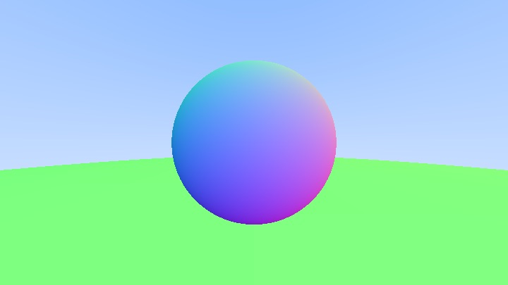
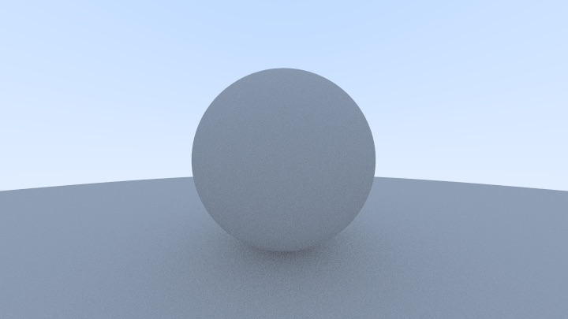

# Ray Tracing

[_Ray Tracing in One Weekend_](https://raytracing.github.io/books/RayTracingInOneWeekend.html)

---

## Output

Original output file is `images/x-x.ppm`

When Surface Normals and Multiple Objects Down

When Diffuse Materials Down

---
## License

MIT

Thanks for [_Ray Tracing in One Weekend_](https://raytracing.github.io/books/RayTracingInOneWeekend.html) project authors' work.
