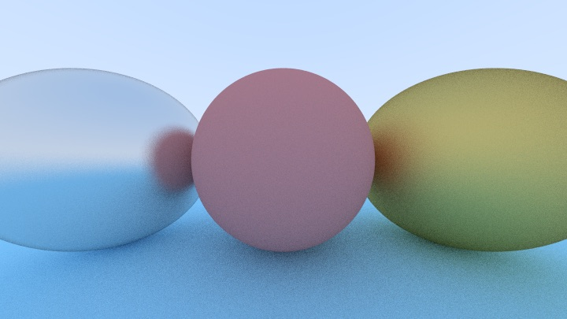
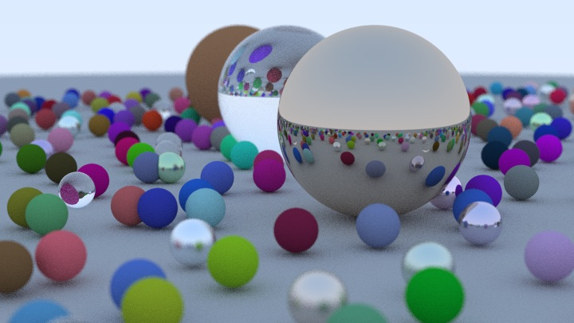

# Ray Tracing

[_Ray Tracing in One Weekend_](https://raytracing.github.io/books/RayTracingInOneWeekend.html)

## Run

```shell
# command tested pass in macOS 12.2 [MBP13 2020 Intel]
make run                # run code and wait for long.
make run mode=s         # run code and wait for little.
# the output image is ./build/image.ppm
```

## Output

Original output file is `images/x-x.ppm`

When Surface Normals and Multiple Objects Down


When Diffuse Materials Down


When Matel Down


Final Render (may cost lots of time)


## Different

- Parallelism speed up, 4 thread speed up 2x+.
- Functional Programming support.
- Code base on C++17.

## Next Plan

- [ ] The next [week](https://raytracing.github.io/books/RayTracingTheNextWeek.html).
- [ ] Camera controler add.
- [ ] Web preview support by wasm.

## License

MIT

Thanks for [_Ray Tracing in One Weekend_](https://raytracing.github.io/books/RayTracingInOneWeekend.html) project authors' work.
